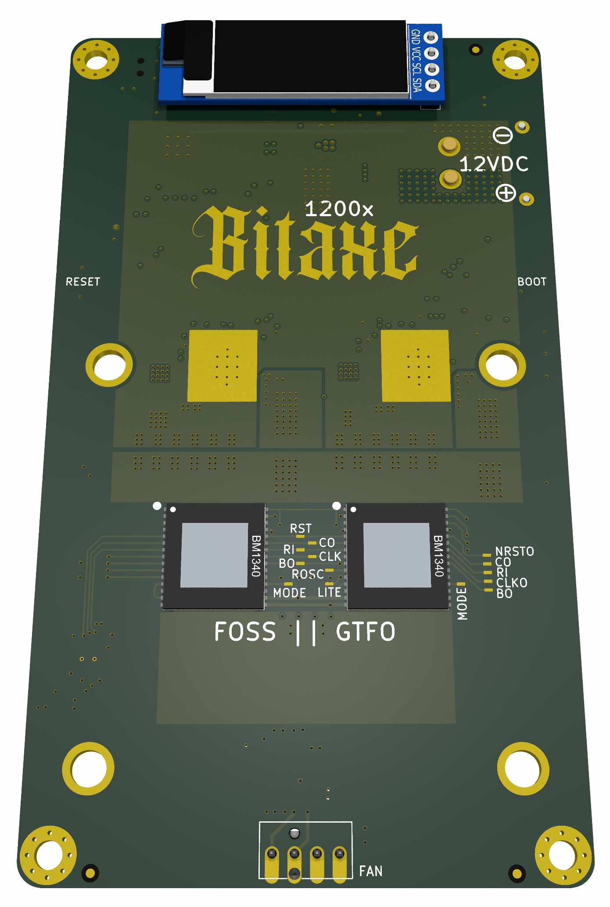

BitaxeNaja is a dual BM1340 Open Source Bitcoin miner using [esp-miner](https://github.com/skot/esp-miner)

The BM1340 used in this design is suspected to be a prototype version of the ASIC used in the Antminer S23 series miners.

It is still an untested prototype! Don't build this expecting it to work at all.

